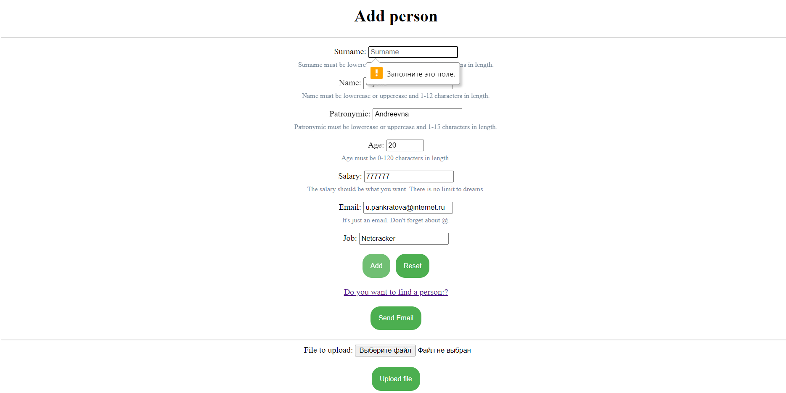
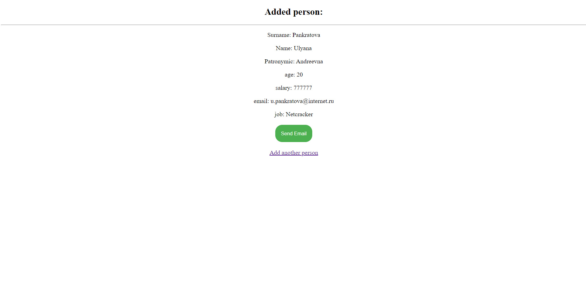
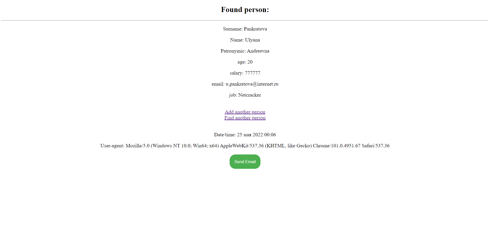
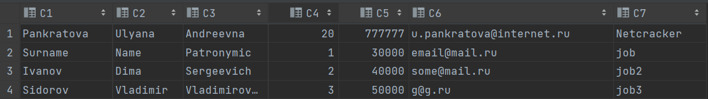
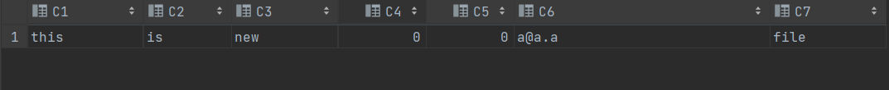

Task:
---

1. Implement a form for recording user data containing last name, first name, patronymic, age, salary level, email address and place of work. The data must be written to a file in the format you have chosen. For simplicity, we can assume that the file was created on the backend e and is located in the classpath of your application. The format for storing records can be arbitrary.
2. It is necessary to perform the simplest validation of input data. Come up with the validation criteria yourself. But not less than for two fields. You can and should actively use regular expressions.
3. Provide the possibility of obtaining data about the user by last name and first name. If the user is found, then in addition to the output information, add the current time and the name of the browser (user-agent) from which the request was made. If there is no such user in the file, then redirect to the page with the message that the user has not been found. Or return the appropriate status code for this case (see HTTP protocol RFC document) using the ResponseEntity entity.
4. Implement the ability to download user data from an external file (file upload).

    Home page:

    After adding a person:

    Page for searching for a person in a file:

    The page after the person was found:

    Our source file with some records:

    A new file uploaded from outside:
